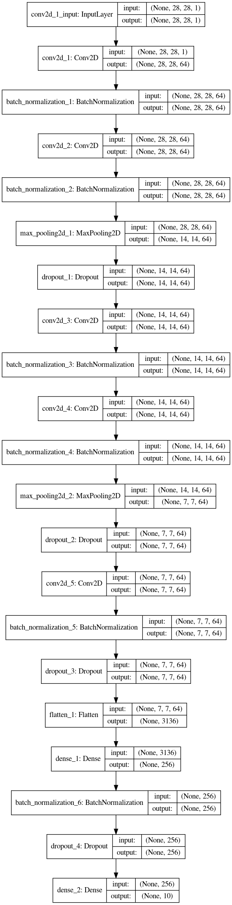

# My first Model for MNIST Handwritten Digit Recognition With Keras 

### Step 1 : Loading Data 


```python
from keras.datasets import mnist

# Load The Mnist Dataset 
(x_train, y_train), (x_test, y_test) = mnist.load_data()
```

    Using TensorFlow backend.
    /home/rabie/anaconda3/envs/personal_projects/lib/python3.7/site-packages/tensorflow/python/framework/dtypes.py:516: FutureWarning: Passing (type, 1) or '1type' as a synonym of type is deprecated; in a future version of numpy, it will be understood as (type, (1,)) / '(1,)type'.
      _np_qint8 = np.dtype([("qint8", np.int8, 1)])
    /home/rabie/anaconda3/envs/personal_projects/lib/python3.7/site-packages/tensorflow/python/framework/dtypes.py:517: FutureWarning: Passing (type, 1) or '1type' as a synonym of type is deprecated; in a future version of numpy, it will be understood as (type, (1,)) / '(1,)type'.
      _np_quint8 = np.dtype([("quint8", np.uint8, 1)])
    /home/rabie/anaconda3/envs/personal_projects/lib/python3.7/site-packages/tensorflow/python/framework/dtypes.py:518: FutureWarning: Passing (type, 1) or '1type' as a synonym of type is deprecated; in a future version of numpy, it will be understood as (type, (1,)) / '(1,)type'.
      _np_qint16 = np.dtype([("qint16", np.int16, 1)])
    /home/rabie/anaconda3/envs/personal_projects/lib/python3.7/site-packages/tensorflow/python/framework/dtypes.py:519: FutureWarning: Passing (type, 1) or '1type' as a synonym of type is deprecated; in a future version of numpy, it will be understood as (type, (1,)) / '(1,)type'.
      _np_quint16 = np.dtype([("quint16", np.uint16, 1)])
    /home/rabie/anaconda3/envs/personal_projects/lib/python3.7/site-packages/tensorflow/python/framework/dtypes.py:520: FutureWarning: Passing (type, 1) or '1type' as a synonym of type is deprecated; in a future version of numpy, it will be understood as (type, (1,)) / '(1,)type'.
      _np_qint32 = np.dtype([("qint32", np.int32, 1)])
    /home/rabie/anaconda3/envs/personal_projects/lib/python3.7/site-packages/tensorflow/python/framework/dtypes.py:525: FutureWarning: Passing (type, 1) or '1type' as a synonym of type is deprecated; in a future version of numpy, it will be understood as (type, (1,)) / '(1,)type'.
      np_resource = np.dtype([("resource", np.ubyte, 1)])
    /home/rabie/anaconda3/envs/personal_projects/lib/python3.7/site-packages/tensorboard/compat/tensorflow_stub/dtypes.py:541: FutureWarning: Passing (type, 1) or '1type' as a synonym of type is deprecated; in a future version of numpy, it will be understood as (type, (1,)) / '(1,)type'.
      _np_qint8 = np.dtype([("qint8", np.int8, 1)])
    /home/rabie/anaconda3/envs/personal_projects/lib/python3.7/site-packages/tensorboard/compat/tensorflow_stub/dtypes.py:542: FutureWarning: Passing (type, 1) or '1type' as a synonym of type is deprecated; in a future version of numpy, it will be understood as (type, (1,)) / '(1,)type'.
      _np_quint8 = np.dtype([("quint8", np.uint8, 1)])
    /home/rabie/anaconda3/envs/personal_projects/lib/python3.7/site-packages/tensorboard/compat/tensorflow_stub/dtypes.py:543: FutureWarning: Passing (type, 1) or '1type' as a synonym of type is deprecated; in a future version of numpy, it will be understood as (type, (1,)) / '(1,)type'.
      _np_qint16 = np.dtype([("qint16", np.int16, 1)])
    /home/rabie/anaconda3/envs/personal_projects/lib/python3.7/site-packages/tensorboard/compat/tensorflow_stub/dtypes.py:544: FutureWarning: Passing (type, 1) or '1type' as a synonym of type is deprecated; in a future version of numpy, it will be understood as (type, (1,)) / '(1,)type'.
      _np_quint16 = np.dtype([("quint16", np.uint16, 1)])
    /home/rabie/anaconda3/envs/personal_projects/lib/python3.7/site-packages/tensorboard/compat/tensorflow_stub/dtypes.py:545: FutureWarning: Passing (type, 1) or '1type' as a synonym of type is deprecated; in a future version of numpy, it will be understood as (type, (1,)) / '(1,)type'.
      _np_qint32 = np.dtype([("qint32", np.int32, 1)])
    /home/rabie/anaconda3/envs/personal_projects/lib/python3.7/site-packages/tensorboard/compat/tensorflow_stub/dtypes.py:550: FutureWarning: Passing (type, 1) or '1type' as a synonym of type is deprecated; in a future version of numpy, it will be understood as (type, (1,)) / '(1,)type'.
      np_resource = np.dtype([("resource", np.ubyte, 1)])


### Step 2 : Data Examination & Visualization


```python
# Examine the shapes of our train ana test data

print("Sample's number in training data : " + str(len(x_train)))
print("Sample's number in test data : " + str(len(x_test)))
```

    Sample's number in training data : 60000
    Sample's number in test data : 10000


```python
# Visualize random Pictures from the dataset

import numpy as np
import matplotlib.pyplot as plt
%matplotlib inline

def visualize_data(rows, columns):
    figure = plt.figure(figsize=(12,8),dpi=50)
    for i in range(1,rows*columns+1):
        random_number = np.random.randint(0,len(x_train))
        image = x_train[random_number]
        ax = figure.add_subplot(rows,columns,i)
        # We have to specify the color map "cmap" in order to visualize grayscale images
        plt.imshow(image, cmap='gray')
        plt.title(str(y_train[random_number]))

visualize_data(3,4)
```


```python
# Visualize the distribution of the numbers 
import seaborn as sns
g = sns.countplot(y_train)
print("As We can we have a good distribution of the numbers")
```

    As We can we have a good distribution of the numbers


### Stpe 3 : Data Preprocessing


```python
# Row and column numbers in the image
image_rows = x_train[11].shape[0]
image_columns = x_train[11].shape[1]

image_shape = (image_rows,image_rows,1)

# Reshape our data in the right shape for the keras model and convert them to float32
x_train = x_train.reshape(-1,image_rows,image_columns,1).astype('float32')
x_test = x_test.reshape(-1,image_rows,image_columns,1).astype('float32')

# Normalize The data
x_train /= 255.0
x_test /= 255.0

# Verify shapes and samples
print('x_train shape :', x_train.shape)
print(x_train.shape[0], 'train samples')
print(x_test.shape[0], 'test samples')
```

    x_train shape : (60000, 28, 28, 1)
    60000 train samples
    10000 test samples


```python
from keras.utils import np_utils

# Since We have 10 different labels we have to one hot encode them
y_train = np_utils.to_categorical(y_train)
y_test = np_utils.to_categorical(y_test)

classes_number = y_test.shape[1] # 10
pixels_number = x_train.shape[1] * x_train.shape[2] # 28* 28
print("The Classe's Number is ", str(classes_number))
```

    The Classe's Number is  10


### Step 4 : Model Creation


```python
from keras.models import Sequential
from keras.layers import Dense, Dropout, Flatten, Conv2D, MaxPool2D, BatchNormalization
from keras.optimizers import RMSprop
from keras.preprocessing.image import ImageDataGenerator
from keras.callbacks import ReduceLROnPlateau

#Creating CNN model
"""
  [[Conv2D->relu]*2 -> BatchNormalization -> MaxPool2D -> Dropout]*2 -> 
  [Conv2D->relu]*2 -> BatchNormalization -> Dropout -> 
  Flatten -> Dense -> BatchNormalization -> Dropout -> Out
"""
model = Sequential()

model.add(Conv2D(filters = 64, kernel_size = (5,5),padding = 'Same', activation ='relu', input_shape = (28,28,1)))
model.add(BatchNormalization())

model.add(Conv2D(filters = 64, kernel_size = (5,5),padding = 'Same', activation ='relu'))
model.add(BatchNormalization())

model.add(MaxPool2D(pool_size=(2,2)))
model.add(Dropout(0.25))

model.add(Conv2D(filters = 64, kernel_size = (3,3),padding = 'Same', activation ='relu'))
model.add(BatchNormalization())

model.add(Conv2D(filters = 64, kernel_size = (3,3),padding = 'Same', activation ='relu'))
model.add(BatchNormalization())
model.add(MaxPool2D(pool_size=(2,2), strides=(2,2)))
model.add(Dropout(0.25))

model.add(Conv2D(filters = 64, kernel_size = (3,3), padding = 'Same',  activation ='relu'))
model.add(BatchNormalization())
model.add(Dropout(0.25))

model.add(Flatten())
model.add(Dense(256, activation = "relu"))
model.add(BatchNormalization())
model.add(Dropout(0.25))

model.add(Dense(10, activation = "softmax"))

# Define the optimizer
optimizer = RMSprop(lr=0.001, rho=0.9, epsilon=1e-08, decay=0.0)

# Compile The Model
model.compile(optimizer = optimizer,
              loss = "categorical_crossentropy",
              metrics=["accuracy"])

model.summary()
```

    WARNING:tensorflow:From /home/rabie/anaconda3/envs/personal_projects/lib/python3.7/site-packages/keras/backend/tensorflow_backend.py:66: The name tf.get_default_graph is deprecated. Please use tf.compat.v1.get_default_graph instead.
    
    WARNING:tensorflow:From /home/rabie/anaconda3/envs/personal_projects/lib/python3.7/site-packages/keras/backend/tensorflow_backend.py:541: The name tf.placeholder is deprecated. Please use tf.compat.v1.placeholder instead.
    
    WARNING:tensorflow:From /home/rabie/anaconda3/envs/personal_projects/lib/python3.7/site-packages/keras/backend/tensorflow_backend.py:4432: The name tf.random_uniform is deprecated. Please use tf.random.uniform instead.
    
    WARNING:tensorflow:From /home/rabie/anaconda3/envs/personal_projects/lib/python3.7/site-packages/keras/backend/tensorflow_backend.py:190: The name tf.get_default_session is deprecated. Please use tf.compat.v1.get_default_session instead.
    
    WARNING:tensorflow:From /home/rabie/anaconda3/envs/personal_projects/lib/python3.7/site-packages/keras/backend/tensorflow_backend.py:197: The name tf.ConfigProto is deprecated. Please use tf.compat.v1.ConfigProto instead.
    
    WARNING:tensorflow:From /home/rabie/anaconda3/envs/personal_projects/lib/python3.7/site-packages/keras/backend/tensorflow_backend.py:2041: The name tf.nn.fused_batch_norm is deprecated. Please use tf.compat.v1.nn.fused_batch_norm instead.
    
    WARNING:tensorflow:From /home/rabie/anaconda3/envs/personal_projects/lib/python3.7/site-packages/keras/backend/tensorflow_backend.py:4267: The name tf.nn.max_pool is deprecated. Please use tf.nn.max_pool2d instead.
    
    WARNING:tensorflow:From /home/rabie/anaconda3/envs/personal_projects/lib/python3.7/site-packages/keras/backend/tensorflow_backend.py:3733: calling dropout (from tensorflow.python.ops.nn_ops) with keep_prob is deprecated and will be removed in a future version.
    Instructions for updating:
    Please use `rate` instead of `keep_prob`. Rate should be set to `rate = 1 - keep_prob`.
    WARNING:tensorflow:From /home/rabie/anaconda3/envs/personal_projects/lib/python3.7/site-packages/keras/optimizers.py:793: The name tf.train.Optimizer is deprecated. Please use tf.compat.v1.train.Optimizer instead.
    
    Model: "sequential_1"
    _________________________________________________________________
    Layer (type)                 Output Shape              Param #   
    =================================================================
    conv2d_1 (Conv2D)            (None, 28, 28, 64)        1664      
    _________________________________________________________________
    batch_normalization_1 (Batch (None, 28, 28, 64)        256       
    _________________________________________________________________
    conv2d_2 (Conv2D)            (None, 28, 28, 64)        102464    
    _________________________________________________________________
    batch_normalization_2 (Batch (None, 28, 28, 64)        256       
    _________________________________________________________________
    max_pooling2d_1 (MaxPooling2 (None, 14, 14, 64)        0         
    _________________________________________________________________
    dropout_1 (Dropout)          (None, 14, 14, 64)        0         
    _________________________________________________________________
    conv2d_3 (Conv2D)            (None, 14, 14, 64)        36928     
    _________________________________________________________________
    batch_normalization_3 (Batch (None, 14, 14, 64)        256       
    _________________________________________________________________
    conv2d_4 (Conv2D)            (None, 14, 14, 64)        36928     
    _________________________________________________________________
    batch_normalization_4 (Batch (None, 14, 14, 64)        256       
    _________________________________________________________________
    max_pooling2d_2 (MaxPooling2 (None, 7, 7, 64)          0         
    _________________________________________________________________
    dropout_2 (Dropout)          (None, 7, 7, 64)          0         
    _________________________________________________________________
    conv2d_5 (Conv2D)            (None, 7, 7, 64)          36928     
    _________________________________________________________________
    batch_normalization_5 (Batch (None, 7, 7, 64)          256       
    _________________________________________________________________
    dropout_3 (Dropout)          (None, 7, 7, 64)          0         
    _________________________________________________________________
    flatten_1 (Flatten)          (None, 3136)              0         
    _________________________________________________________________
    dense_1 (Dense)              (None, 256)               803072    
    _________________________________________________________________
    batch_normalization_6 (Batch (None, 256)               1024      
    _________________________________________________________________
    dropout_4 (Dropout)          (None, 256)               0         
    _________________________________________________________________
    dense_2 (Dense)              (None, 10)                2570      
    =================================================================
    Total params: 1,022,858
    Trainable params: 1,021,706
    Non-trainable params: 1,152
    _________________________________________________________________


```python
# Set a learning rate annealer
learning_rate_reduction = ReduceLROnPlateau(monitor='val_acc', 
                                            patience=3, 
                                            verbose=1, 
                                            factor=0.5, 
                                            min_lr=0.00001)
```


```python
## Let's see How our model look like
from keras.utils import plot_model
plot_model(model, to_file='model.png', show_shapes=True, show_layer_names=True)
from IPython.display import Image
Image("model.png")
```





### Step 5 : Train The Model


```python
batch_size = 64
epochs = 1 # Change to a bigger value to gain more accuaracy ex 30

history = model.fit(x_train,
                   y_train,
                   batch_size=batch_size,
                   epochs = epochs,
                   verbose = 1,
                   validation_data = (x_test, y_test),callbacks=[learning_rate_reduction])

score = model.evaluate(x_test,y_test, verbose=0)
print('Test loss:', score[0])
print('Test accuracy:', score[1])
```

    WARNING:tensorflow:From /home/rabie/anaconda3/envs/personal_projects/lib/python3.7/site-packages/tensorflow/python/ops/math_grad.py:1250: add_dispatch_support.<locals>.wrapper (from tensorflow.python.ops.array_ops) is deprecated and will be removed in a future version.
    Instructions for updating:
    Use tf.where in 2.0, which has the same broadcast rule as np.where
    Train on 60000 samples, validate on 10000 samples
    Epoch 1/1
    60000/60000 [==============================] - 653s 11ms/step - loss: 0.1189 - acc: 0.9637 - val_loss: 0.0824 - val_acc: 0.9754
    Test loss: 0.08244079233815428
    Test accuracy: 0.9754


### Step 6 : Evaluate Our Model : Confusion Matrix, Loss & Accuaracy Plots 


```python
# Look at confusion matrix 

from sklearn.metrics import confusion_matrix
import itertools

def plot_confusion_matrix(cm, classes,
                          normalize=False,
                          title='Confusion matrix',
                          cmap=plt.cm.Blues):
    """
    This function prints and plots the confusion matrix.
    Normalization can be applied by setting `normalize=True`.
    """
    fig = plt.figure(figsize=(12,8))
    plt.imshow(cm, interpolation='nearest', cmap=cmap)
    plt.title(title)
    plt.colorbar()
    tick_marks = np.arange(len(classes))
    plt.xticks(tick_marks, classes, rotation=45)
    plt.yticks(tick_marks, classes)

    if normalize:
        cm = cm.astype('float') / cm.sum(axis=1)[:, np.newaxis]

    thresh = cm.max() / 2.
    for i, j in itertools.product(range(cm.shape[0]), range(cm.shape[1])):
        plt.text(j, i, cm[i, j],
        horizontalalignment="center",
        color="white" if cm[i, j] > thresh else "black")

    plt.tight_layout()
    plt.ylabel('True label')
    plt.xlabel('Predicted label')

# Predict the values from the test dataset
Y_pred = model.predict(x_test)
# Convert predictions classes to one hot vectors 
Y_pred_classes = np.argmax(Y_pred,axis = 1) 
# Convert test observations to one hot vectors
Y_true = np.argmax(y_test,axis = 1) 
# compute the confusion matrix
confusion_mtx = confusion_matrix(Y_true, Y_pred_classes) 
# plot the confusion matrix
plot_confusion_matrix(confusion_mtx, classes = range(10))
```


```python
fig, ax = plt.subplots(2,1)
ax[0].plot(history.history['loss'], color='b', label="Training loss")
ax[0].plot(history.history['val_loss'], color='r', label="validation loss",axes =ax[0])
legend = ax[0].legend(loc='best', shadow=True)

ax[1].plot(history.history['acc'], color='b', label="Training accuracy")
ax[1].plot(history.history['val_acc'], color='r',label="Validation accuracy")
legend = ax[1].legend(loc='best', shadow=True)

print("Since We set epochs = 1 we have only one value ! Change it to a bigger value to visualize a plot")
```

    Since We set epochs = 1 we have only one value ! Change it to a bigger value to visualize a plot


```python
# Save The Model
model.save("./cnn_for_mnist.h5")
print("Model Saved")
```

    Model Saved


```python
# Load The Model
from keras.models import load_model
classifier = load_model("./cnn_for_mnist.h5")
```

### Last Step : Test Our Model


```python
import cv2
import numpy as np


def draw_test(name, pred, input_im):
    BLACK = [0,0,0]
    expanded_image = cv2.copyMakeBorder(input_im, 0, 0, 0, imageL.shape[0] ,cv2.BORDER_CONSTANT,value=BLACK)
    expanded_image = cv2.cvtColor(expanded_image, cv2.COLOR_GRAY2BGR)
    cv2.putText(expanded_image, str(pred), (152, 70) , cv2.FONT_HERSHEY_COMPLEX_SMALL,4, (0,255,255), 2)
    cv2.imshow(name, expanded_image)


for i in range(0,10):
    rand = np.random.randint(0,len(x_test))
    input_im = x_test[rand]

    imageL = cv2.resize(input_im, None, fx=4, fy=4, interpolation = cv2.INTER_CUBIC)
    input_im = input_im.reshape(1,28,28,1) 
    
    ## Get Prediction
    res = str(classifier.predict_classes(input_im, 1, verbose = 0)[0])

    draw_test("Prediction", res, imageL) 
    cv2.waitKey(0)

cv2.destroyAllWindows()
```


```python

```


```python

```
